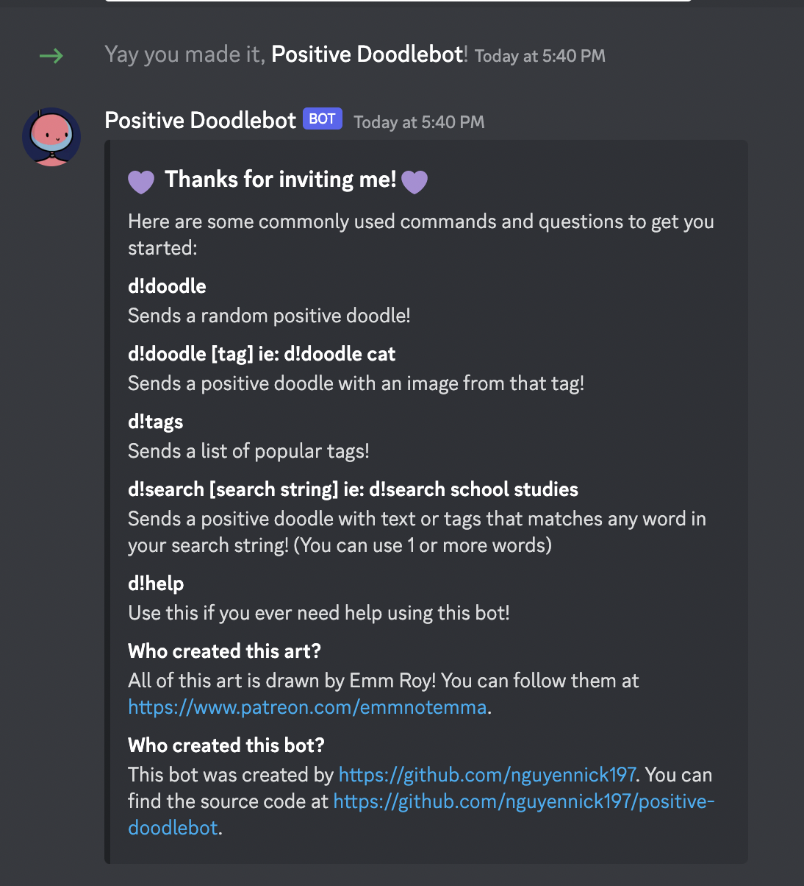
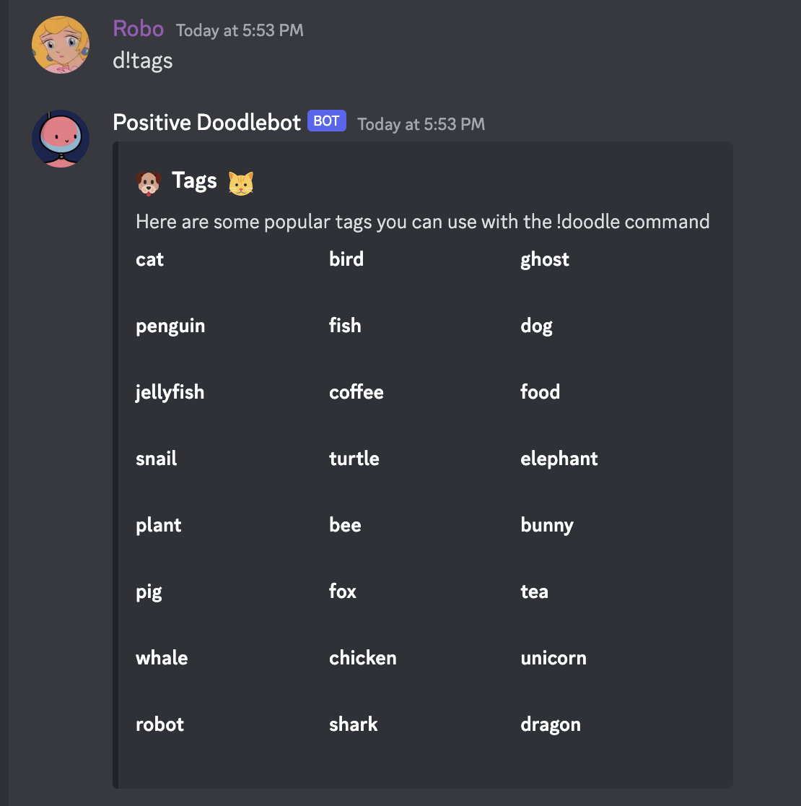

# Positive Doodle Discord Bot

This is a Discord bot that sends drawings from the positivedoodles tumblr, created by Emm Roy. Drawings are not allowed to be used for profit. Documentation on how to use the bot is provided below.

## Emm Roy's socials
 - [Patreon](https://www.patreon.com/emmnotemma)
 - [Twitter](https://twitter.com/emmnotemma)
 - [Tumblr](https://positivedoodles.tumblr.com/)

## Built With
 - [Discord.js](https://discordjs.guide/)
 - [Node](https://nodejs.org/en/)
 - [Express](https://expressjs.com/)

## Contributors 
 - [Nick Nguyen](https://github.com/nguyennick197)

## Usage

To use the bot, you will need to invite it to your Discord server.

1. Open the following URL in your browser

`https://discord.com/api/oauth2/authorize?client_id=1046672661016752130&permissions=534723819584&scope=bot`

2. Select the server you want to add the bot to and click `Authorize`.

The Positive Doodlebot should now be a member of your server and you can use the commands below to send cute images.

## Commands

 - `d!doodle`: sends a random positive doodle
 - `d!doodle [tag]`: get a positive doodle from this tag! ex: `d!doodle cat`
 - `d!tag`: sends a list of popular tags you can use 
 - `d!search [search string]`: get a positive doodle that matches this search term (search term can be 1 or more words)! ex: `d!search school studies`
 - `d!help`: Sends a list of commands and details about the bot

## Screenshots

